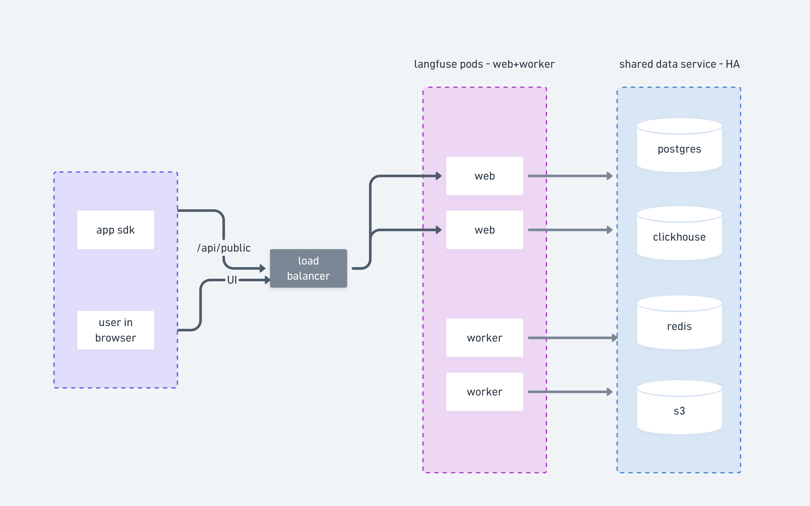
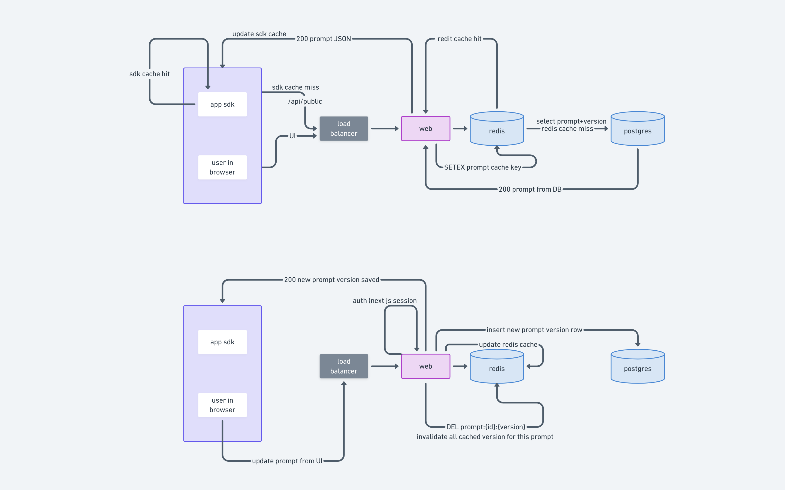

# self-hosting langfuse
running langfuse on our own infra instead of paying for their cloud.


#### why we want to self-host this

- data protection.
- cost.
- vendor independence - reducing dependency on langfuse.
- we get to put it behind our sso/auth-layer and our normal infra controls (vpc, audit logs, backups, etc).


#### how langfuse is built

- there are 6 moving parts. 
- two of them are app code we run, four are data stores.

| component       | what is does                                                                          | stateful? |
| --------------- | ------------------------------------------------------------------------------------- | --------- |
| langfuse-web    | next.js app. serves the ui and the public api that sdk send traces to.                | no        |
| langfuse-worker | background processor. reads jobs from redis, writes processed traces to clickhouse.   | no        |
| postgres        | holds app config: users, projects, api keys, settings, evaluation configs.            | yes       |
| clickhouse      | holds the actual trace data. this is the big one (high-volume, time-series).          | yes       |
| redis           | job queue (bullmq) + cache + rate limit counters.                                     | yes       |
| s3              | blob store. raw trace events land here before workers read and process them.          | yes       |

- the web pod (langfuse-web) doesn't write directly to clickhouse during ingestion. 
- it writes the raw event to s3 + drops a job into redis. 
- the worker picks it up later and batches writes into clickhouse. 
- this buffering lets the system handle spikes without dropping data.

### deployment plan

> scale the app pods, share everything else.

#### what we share

- one postgres cluster (managed, e.g. rds).
- one redis (managed, e.g. elasticache, with `maxmemory-policy=noeviction`).
- one clickhouse cluster (either clickhouse cloud, or self-run on a few ec2 nodes, or a kubernetes operator deployment).
- one s3 bucket (or two, if we want to split events and media).

#### what we scale

- `langfuse-web` 
  - scale based on incoming HTTP traffic. 
  - sdk ingestion calls hit this. 
  - also serves the UI.

- `langfuse-worker` 
  - scale based on redis queue depth. 
  - if the queue grows, add more workers. 
  - they process trace events and write them to clickhouse.

- both scale independently. 
- a heavy ui day doesn't need more workers. 
- a heavy ingestion day doesn't need more web pods (well, a little, but mostly more workers).

### architecture



#### how prompt management flows through

- prompt management is the other big public-api workload. 
- unlike trace ingestion, prompts live in **postgres** (not clickhouse)
- the read path is heavily cached in redis because production apps fetch the same prompt over and over again. 
- clickhouse and the worker are not involved at all here.
- production app might call `get_prompt(<prompt_label>)` thousands of times a minute. redis caching is what makes this cheap.
- SDKs also cache client side. 
- most server calls only happen on cold start or background refresh. so real traffic to the web pod is far lower.
- prompts are versioned. every edit creates a new row, old versions stay forever. 
- the `prompts` table grows slowly compared to clickhouse traces, so a small postgres is fine.
- when someone publishes a new version, the web pod deletes the cached entries so the next read picks up fresh data.



A few things to call out from this:


#### what runs where

| component         | service we'd use                    |
| ----------------- | ----------------------------------- |
| `langfuse-web`    | ecs / eks / fargate                 |
| `langfuse-worker` | ecs / eks / fargate                 |
| postgres          | rds postgres 17                     |
| redis             | elasticache redis 7                 |
| clickhouse        | clickhouse cloud or self-run on EC2 |
| s3                | s3                                  |
| load balancer     | alb                                 |

### clickhouse: disposable by design

- the source of truth for all trace data is s3. 
- every otel log, every trace event, lands in s3 before it ever touches clickhouse.
- this means clickhouse data is replayable.

```
s3 otel logs → replay worker → langfuse public api → redis queue → langfuse-worker → clickhouse rebuilt
```

**timestamp behaviour on redrive**: original trace timestamps (`start_time`, `end_time`) come from the otel span payload and are preserved exactly - even after 6 months. clickhouse orders traces by `start_time`, so sort order is correct. the only field that changes is `created_at` (when langfuse ingested the event), which will reflect the replay time. 

#### why keep clickhouse at all?

- langfuse v3 hard-depends on it. 
- removing it would require forking langfuse. not worth it.

#### clickhouse memory

- clickhouse needs a minimum of **1 GB ram**. 
- the migration step alone consumes ~519 MB. 
- a hard cap of 512 MB causes `memory limit exceeded` on startup. 
- 1 GB fixes it.

`docker-compose.prod.with-clickhouse.yml` sets:
```yaml
deploy:
  resources:
    limits:   { memory: "2G" }
    reservations: { memory: "1G" }
```

full stack memory budget on a t3.xlarge (16 GB):

| service              | reservation | limit  |
| -------------------- | ----------- | ------ |
| langfuse-web         | 1 G         |  4 G   |
| langfuse-worker      | 1 G         |  4 G   |
| clickhouse           | 1 G         |  2 G   |
| os + docker overhead | —           | ~2 G   |
| **headroom**         | —           | ~4 G   |

- fits comfortably on a t3.xlarge.

#### clickhouse system tables

- by default, clickhouse runs internal logging tables that grow indefinitely with no ttl.
- on a fresh deployment with zero langfuse traces, these accumulated around **~600 MB** data in 2 months:

| table | size observed | what it is |
|---|---|---|
| `system.trace_log` | 286 MB | cpu profiler samples |
| `system.metric_log` | 202 MB | periodic metric snapshots every few seconds |
| `system.asynchronous_metric_log` | 81 MB | background metric polling (185M rows) |
| `system.query_log` | 23 MB | every query clickhouse ran |
| `system.processors_profile_log` | 21 MB | per-query pipeline profiling |

- we can truncate data periodically and restart.
- or disable them in `opt/clickhouse/config.xml` inside the `<clickhouse>` block.

```xml
<trace_log remove="1"/>
<metric_log remove="1"/>
<asynchronous_metric_log remove="1"/>
<query_log remove="1"/>
<processors_profile_log remove="1"/>
```

#### capacity measurements (from poc)

measured with real interview traces: 8 otel json files = 1 interview.

| metric | value |
|---|---|
| traces per interview | 25 |
| observation rows (spans) per interview | 163 |
| clickhouse disk per interview | ~40 KiB |
| clickhouse disk per span | ~238 bytes (compressed by clickhouse automatically — see note below) |
| clickhouse `MemoryTracking` at rest | ~129 MB (heap memory the clickhouse allocator explicitly owns: caches, merge threads, query contexts) |
| clickhouse container RSS | ~1 GB (total physical ram the OS maps to the process: MemoryTracking + shared libs + mmap'd column files + jit pages. the ~870 MB gap between the two is normal.) |

> **clickhouse compresses automatically.** MergeTree stores data in columnar format (all values of the same column grouped across rows), then applies LZ4 compression. similar values in a column compress extremely well. `bytes_on_disk` in `system.parts` is always the post-compression size — you never interact with compression manually. it decompresses transparently on read.

**scenario A — current traces (fastapi http spans only, no llm content): ~40 KiB/interview**

| available for traces | max interviews |
|---|---|
| 1 GB | ~26,000 |
| 3 GB | ~77,000 |
| 26 GB (dedicated 30 GB EBS after OS) | ~672,000 |

**scenario B — with llm generation spans (full prompt + response in attributes): ~800 KiB/interview**

| available for traces | max interviews |
|---|---|
| 1 GB | ~1,280 |
| 3 GB | ~3,840 |
| 26 GB (dedicated 30 GB EBS after OS) | ~33,000 |

> the 800 KiB/interview estimate assumes llm input/output is stored as span attributes (e.g. `gen_ai.input`, `gen_ai.output`). measure with a real llm trace before finalising ebs sizing — this is the number that determines your actual wipe frequency.

#### bottleneck analysis (dedicated clickhouse-only ec2)

for a dedicated ec2 running only the clickhouse container:

| resource | bottleneck? | notes |
|---|---|---|
| disk (ebs) | yes | deterministic, easy to monitor. wipe at 80%. |
| cpu, ram | no | won't be a bottleneck if we limit the ingestion rates. |
| parts count | no | clickhouse's "too many parts" only triggers with thousands of tiny inserts/second. |

**recommended dedicated instance**: t3.large (8 GB RAM) + 30–50 GB gp3 EBS.
- clickhouse gets 6.4 GB ram headroom (80% of 8 GB).
- 1 GB goes to idle rss, 5.4 GB available for query execution.
- headroom matters when querying across large date ranges or running concurrent analytics.

**estimated capacity with llm content in spans (~800 KiB/interview, scenario B):**

| daily interviews | 30 GB EBS | 50 GB EBS |
|---|---|---|
| 100/day | ~11 months | ~19 months |
| 500/day | ~9 weeks | ~15 weeks |
| 1,000/day | ~4.5 weeks | ~7.5 weeks |

#### wipe procedure

- when disk hits 80% (or every X months), truncate all data tables. 
- replay from s3 on demand. also limit the rate at which the traces gets replayed.

#### cost: self-hosted container vs clickhouse cloud (aws us-east-1)

- option1: co-located on one ec2 [docker-compose.prod.with-clickhouse.yml](./docker-compose.prod.with-clickhouse.yml) 
  - web + worker + clickhouse 
  - marginal compute cost for clickhouse: $0.

  | item                                        | on-demand/month | 1-yr reserved/month |
  | ------------------------------------------- | --------------- | ------------------- |
  | t3.xlarge (web + worker + clickhouse)       | $121.47         | $75.93              |
  | ebs gp3 ~50 GB (clickhouse data + os)       | ~$4             | ~$4                 |
  | replay worker (lambda, async batch from s3) | ~$1             | ~$1                 |
  | **total**                                   | **~$126**       | **~$81**            |

- option2: dedicated ec2 for clickhouse, separate instance for web+worker

  | item                                        | on-demand/month | 1-yr reserved/month |
  | ------------------------------------------- | --------------- | ------------------- |
  | t3.xlarge (web + worker)                    | $121.47         | $75.93              |
  | t3.large (clickhouse only)                  | $60.74          | $37.96              |
  | ebs gp3 ~50 GB for clickhouse               | ~$4             | ~$4                 |
  | replay worker                               | ~$1             | ~$1                 |
  | **total**                                   | **~$187**       | **~$119**           |

- option3: clickhouse cloud (aws us-east-1)
  - storage is the same across tiers: ~$50.60 per TB/month.

  | tier        | min spend/month | notes                                           |
  | ----------- | --------------- | ------------------------------------------------|
  | basic       | $66.52          | single az, shared compute. dev/poc only. no HA. |
  | scale       | $499.38         | production HA, 2 replicas, autoscaling.         |
  | enterprise  | ~$2,670+        | dedicated infra, custom SLA.                    |

  

**opinion**
- **option2 (clickhouse on its own machine) is the right call**.
- clickhouse running on a seperate machine. 
- every web container and every worker container, no matter which machine they're on, just point to this one `CLICKHOUSE_URL`. 
- one source of trace data, no split.
- to keep the clickhouse machine small, we can delete traces older than 15–30 days from clickhouse. 
- the raw data is still safe in s3 forever, so nothing is actually lost. 
- if we need old traces back, we can just replay those from s3. 
- this way clickhouse stays small and we never need to give it a bigger machine.

<br>

- **option3:** clickhouse cloud scale ($499/month) is ~6x more expensive. not worth it when s3 already holds everything and replay is our recovery path.

<br>

- **option1:** puts clickhouse on the same machine as web+worker. 
  - that's fine for one machine, but breaks the moment you add a second machine. 
  - say a trace lands on machine 1 (web1→ch1). 
  - if the next request hits machine 2 (web2→ch2), it won't find that trace, as ch2 doesn't have it. 
  - request hits web1 → finds it. 
  - request hits web2 → not found.

### docker compose file
#### without nginx
- for one web, and one worker
[docker-compose.prod.yml](./docker-compose.prod.yml) - web + worker only.
- no postgres, redis, clickhouse, or minio services. 
- just the two app services. everything else is external.
- both services share the same env block via a YAML anchor (`x-langfuse-env`). this guarantees the secrets are identical on web and worker.
- the worker has no published port. 
- it only takes work from redis. the `3030` port inside the container is just for the health check.


#### with nginx
- [docker-compose.prod.nginx.yml](./docker-compose.prod.nginx.yml)
- [nginx.conf](./nginx/nginx.conf)
- to easily scale multiple langfuse containers in one host.
- scaling on one host can done with `--scale`

```bash
   docker compose -f docker-compose.prod.yml up -d \
   --scale langfuse-web=3 \
   --scale langfuse-worker=1
```

### performance: one `langfuse-web` container

- benchmarked the prompt read path against a single `langfuse-web` container using [prompts/http_load_test.py](./prompts/http_load_test.py):

```bash
python http_load_test.py --total 20000 --concurrency 16
```

- 20000 requests in total
- one langfuse-web container

| concurrency | time (s) | throughput (req/s) | avg (ms) | p50 (ms) | p90 (ms) | p95 (ms) | p99 (ms) | max (ms) |
|------------:|---------:|-------------------:|---------:|---------:|---------:|---------:|---------:|---------:|
| 1           |   135.99 |             147.07 |      6.8 |      6.4 |      7.3 |      8.0 |     16.9 |    157.0 |
| 2           |   115.26 |             173.52 |     11.5 |     10.7 |     12.5 |     14.9 |     24.8 |    207.8 |
| 4           |   102.90 |             194.36 |     20.6 |     19.2 |     24.9 |     28.7 |     36.5 |    377.6 |
| 8           |    91.94 |             217.54 |     36.7 |     34.8 |     44.1 |     48.0 |     58.3 |    473.5 |
| **16**      |**80.59** |         **248.18** | **64.4** | **59.9** | **95.7** |**110.6** |**173.1** |**501.5** |
| 32          |   118.66 |             168.55 |    189.6 |    121.6 |    427.6 |    563.0 |    883.1 |   2051.6 |
| 64          |   205.68 |              97.24 |    657.5 |    467.3 |   1463.1 |   1866.0 |   2828.4 |   5444.4 |

- throughput peaks at **~248 req/s at concurrency 16**, then falls off a cliff.
- at concurrency 32, p99 jumps to 883 ms. at 64, p99 climbs past 2.8 s and throughput drops by 60%.
- so for one web container, **~16 in-flight requests is the sweet spot**.

#### where the bottleneck wasn't

- **postgres**: checked active backends and wait events:
  - no lock waits, 
  - no client-read backlog. 
  - postgres was idle. 
  - the prompt read path is cached in redis, so postgres barely sees traffic.
  ```bash
  docker exec postgres psql -U $POSTGRES_USER -d $POSTGRES_DB \
  -c "select wait_event_type, wait_event, count(*) from pg_stat_activity group by 1,2;"
  ```

- **redis**: checked ops/sec under load:
  ```bash
  redis-cli INFO stats | grep "instantaneous_ops_per_sec"
  ```
  - hovered around ~500 ops/sec. 
  - nowhere near redis's ceiling.

#### where the bottleneck was

the web container only runs **a single node thread**:

```bash
docker exec -it langfuse-poc-langfuse-web-1 sh -c "cat /proc/1/status | grep Threads"
# Threads: 1
```

- one event loop, one cpu core. concurrency > 16 just piles up behind a saturated cpu.
- this explains why p99 explodes past concurrency 16 even though postgres and redis are bored.

### postgres → mysql sync

- langfuse uses postgres as a hard dependency.
- and cannot be swapped for mysql. 
- prisma orm relies on postgres-specific types 
  - `jsonb`, 
  - native `uuid`, `pg_trgm` extension. 
- swapping it for mysql would require forking langfuse. 
- not worth it.


> postgres in langfuse holds only config/metadata: users, projects, api keys, prompts, evaluation configs.


#### options

|   | approach | mechanism | latency | operational complexity | handles hard deletes? |
|---|----------|-----------|--------------|----------------------|-----------------------|
| 1 | aws data migration service, managed CDC (change data capture) | reads postgres write-ahead logs, fully managed | seconds | low, no infra to run | yes |
| 2 | debezium (open-source) + kafka | WAL → debezium → kafka topics → JDBC connector → mysql | sub-second | high - kafka cluster, kafka connect, schema registry | yes |
| 3 | scheduled ETL (lambda) | batch poll on `updated_at`, transform, upsert into mysql | minutes? | low (lambda with rds access) | no - we have to maintain a tombstone table |

#### cost comparison (aws us-east-1, per month)

| line item | aws DMS | debezium + MSK | debezium + self-managed kafka on ec2 | lambda ETL |
|-----------|-----------|-------------------|-----------------------------------------|--------------|
| replication compute | dms.t3.medium: ~$73 | MSK m5.large × 2 brokers: ~$278 | ec2 t3.medium × 2: ~$60 | - |
| replication instance storage (DMS) | ~$10 | - | - | - |
| kafka connect + schema registry | - | t3.small self-hosted: ~$30 | t3.small self-hosted: ~$15 | - |
| lambda invocations (every 5 min) | - | - | - | ~$1–2 |
| data transfer (intra-VPC) | ~$0 | ~$0 | ~$0 | ~$0 |
| **total / month** | **~$83-100** | **~$310-350** | **~$75–100** | **~$1–5** |

#### opinion
> do we really need to sync them? postgreSQL is already managed. why can't we redirect our existing code towards this database?

default pick: Lambda ETL

| pros | cons |
|------|------|
| ~$1/month (nearly free) | hard deletes are invisible - no tombstone, no detection |
| no infra to maintain | sync latency: up to 5 min |
| simple | schema changes in langfuse require updating lambda queries |

upgrade to DMS if: hard delete sync becomes a requirement, or sub-minute latency is needed.


## setup guide

- we are running postgres, redis and clickhouse as a systemd managed docker compose services.
- langfuse web + worker as a seperate docker compose stack.

#### pre-requisites
- recommended ec2 specs : 20gb root ecb volume, t3.xlarge or t3.large
```bash
# verify
df -h
lsblk
```
- docker
```bash
sudo apt update && sudo apt upgrade -y
sudo apt install -y ca-certificates curl gnupg lsb-release

# gpg key
sudo install -m 0755 -d /etc/apt/keyrings
sudo curl -fsSL https://download.docker.com/linux/ubuntu/gpg -o /etc/apt/keyrings/docker.asc
sudo chmod a+r /etc/apt/keyrings/docker.asc

# add apt repo
echo \
  "deb [arch=$(dpkg --print-architecture) signed-by=/etc/apt/keyrings/docker.asc] https://download.docker.com/linux/ubuntu \
  $(. /etc/os-release && echo "$VERSION_CODENAME") stable" | \
  sudo tee /etc/apt/sources.list.d/docker.list > /dev/null

# install
sudo apt update
sudo apt install -y docker-ce docker-ce-cli containerd.io docker-compose-plugin

# allow current user to run docker
sudo usermod -aG docker $USER
newgrp docker

# verify
docker --version
docker run hello-world
```
- python env manager : miniconda
```bash
sudo apt update && sudo apt upgrade -y
sudo apt install -y wget

# switch to your user, do not run the following command as root
cd ~
wget https://repo.anaconda.com/miniconda/Miniconda3-latest-Linux-x86_64.sh
bash Miniconda3-latest-Linux-x86_64.sh
source ~/.bashrc

# verify and create env for langfuse
conda --version
conda config --set auto_activate_base false
conda create -n langfuse python=3.11 -c conda-forge -y

# activate env and install packages
conda activate langfuse
conda install -n langfuse pip
python -m pip install python-dotenv langfuse

# remove script
rm ~/Miniconda3-latest-Linux-x86_64.sh
```
- necessary directories 
```bash
sudo mkdir -p /opt/langfuse
sudo mkdir -p /opt/redis /opt/postgres /opt/postgres/init /opt/clickhouse
```


#### clone the repo
```bash
cd /home/<user>/
git clone https://github.com/mudit-shl/langfuse-poc.git
```

#### copy directories to /opt
```bash
sudo cp -r /home/<user>/langfuse-poc/opt/clickhouse /opt/clickhouse
sudo cp -r /home/<user>/langfuse-poc/opt/postgres   /opt/postgres
sudo cp -r /home/<user>/langfuse-poc/opt/redis      /opt/redis
```

#### copy directories to /etc
```bash
sudo cp /home/<user>/langfuse-poc/etc/systemd/system/postgres.service    /etc/systemd/system/
sudo cp /home/<user>/langfuse-poc/etc/systemd/system/redis.service       /etc/systemd/system/
sudo cp /home/<user>/langfuse-poc/etc/systemd/system/clickhouse.service  /etc/systemd/system/

```

#### configure env variables
```bash
cp /home/<user>/langfuse-poc/.env.prod.example /home/<user>/langfuse-poc/.env.prod
vim /home/<user>/langfuse-poc/.env.prod

# copy .env.prod to /opt/langfuse/.env.prod
cp /home/<user>/langfuse-poc/.env.prod /opt/langfuse/
```

#### environment variables we need to set
[.env.prod.example](./.env.prod.example)
```bash
# secrets
SALT=
ENCRYPTION_KEY=
NEXTAUTH_SECRET=
NEXTAUTH_URL=
# postgres
POSTGRES_USER=
POSTGRES_PASSWORD=
POSTGRES_DB=
DATABASE_URL=
# clickhouse
CLICKHOUSE_USER=
CLICKHOUSE_PASSWORD=
CLICKHOUSE_DB=
CLICKHOUSE_URL=
CLICKHOUSE_MIGRATION_URL=
CLICKHOUSE_CLUSTER_ENABLED=
# redis
REDIS_HOST=
REDIS_PORT=
REDIS_AUTH=
REDIS_TLS_ENABLED=
REDIS_TLS_CA=
REDIS_TLS_CERT=
REDIS_TLS_KEY=
# s3
LANGFUSE_S3_EVENT_UPLOAD_BUCKET=
LANGFUSE_S3_EVENT_UPLOAD_REGION=
LANGFUSE_S3_EVENT_UPLOAD_ACCESS_KEY_ID=
LANGFUSE_S3_EVENT_UPLOAD_SECRET_ACCESS_KEY=
LANGFUSE_S3_EVENT_UPLOAD_ENDPOINT=
LANGFUSE_S3_EVENT_UPLOAD_FORCE_PATH_STYLE=
LANGFUSE_S3_EVENT_UPLOAD_PREFIX=
LANGFUSE_S3_MEDIA_UPLOAD_BUCKET=
LANGFUSE_S3_MEDIA_UPLOAD_REGION=
LANGFUSE_S3_MEDIA_UPLOAD_ACCESS_KEY_ID=
LANGFUSE_S3_MEDIA_UPLOAD_SECRET_ACCESS_KEY=
LANGFUSE_S3_MEDIA_UPLOAD_ENDPOINT=
LANGFUSE_S3_MEDIA_UPLOAD_FORCE_PATH_STYLE=
LANGFUSE_S3_MEDIA_UPLOAD_PREFIX=
LANGFUSE_S3_BATCH_EXPORT_ENABLED=
LANGFUSE_S3_BATCH_EXPORT_BUCKET=
LANGFUSE_S3_BATCH_EXPORT_REGION=
LANGFUSE_S3_BATCH_EXPORT_ACCESS_KEY_ID=
LANGFUSE_S3_BATCH_EXPORT_SECRET_ACCESS_KEY=
LANGFUSE_S3_BATCH_EXPORT_ENDPOINT=
LANGFUSE_S3_BATCH_EXPORT_EXTERNAL_ENDPOINT=
LANGFUSE_S3_BATCH_EXPORT_FORCE_PATH_STYLE=
LANGFUSE_S3_BATCH_EXPORT_PREFIX=
# misc
TELEMETRY_ENABLED=
LANGFUSE_ENABLE_EXPERIMENTAL_FEATURES=
LANGFUSE_USE_AZURE_BLOB=
LANGFUSE_USE_OCI_NATIVE_OBJECT_STORAGE=
LANGFUSE_OCI_AUTH_TYPE=
LANGFUSE_INGESTION_QUEUE_DELAY_MS=
LANGFUSE_INGESTION_CLICKHOUSE_WRITE_INTERVAL_MS=
EMAIL_FROM_ADDRESS=
SMTP_CONNECTION_URL=
LANGFUSE_INIT_ORG_ID=
LANGFUSE_INIT_ORG_NAME=
LANGFUSE_INIT_PROJECT_ID=
LANGFUSE_INIT_PROJECT_NAME=
LANGFUSE_INIT_PROJECT_PUBLIC_KEY=
LANGFUSE_INIT_PROJECT_SECRET_KEY=
LANGFUSE_INIT_USER_EMAIL=
LANGFUSE_INIT_USER_NAME=
LANGFUSE_INIT_USER_PASSWORD=
```

#### verify health
```bash
# start services
sudo systemctl daemon-reload
sudo systemctl enable postgres redis clickhouse
sudo systemctl start postgres redis clickhouse
sleep 20

# check status
sudo systemctl status postgres redis clickhouse

# individual service check
docker exec clickhouse clickhouse-client --query "SELECT 1"
docker exec redis redis-cli -a <REDIS_AUTH> ping
docker exec postgres sh -c 'pg_isready -U "$POSTGRES_USER" -d "$POSTGRES_DB"'
```

#### start langfuse worker+web
```bash
cd /home/<user>/langfuse-poc/
docker compose -f docker-compose.prod.yml --env-file .env.prod up -d
sleep 15

# verify
docker compose -f docker-compose.prod.yml --env-file .env.prod ps
curl http://localhost:3000/api/public/health # → {"status":"ok"}

# view logs
docker compose -f docker-compose.prod.yml --env-file .env.prod logs -f
```

```bash
# or, verify by ssh tunnel
ssh -L 3000:localhost:3000 <user>:<private-ip>
```