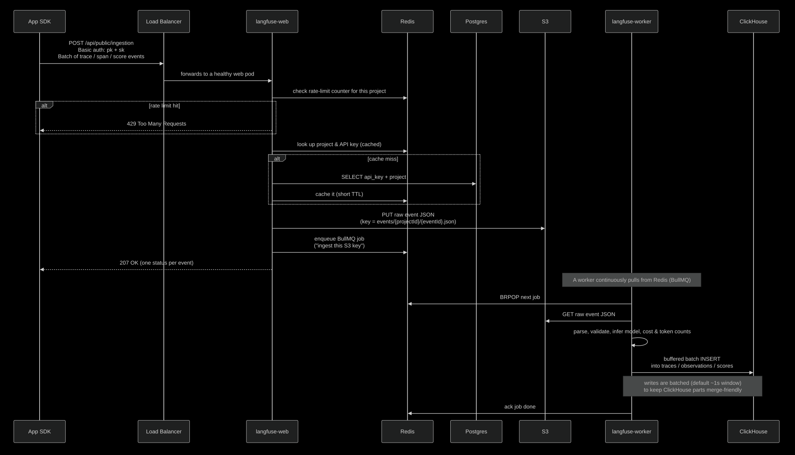
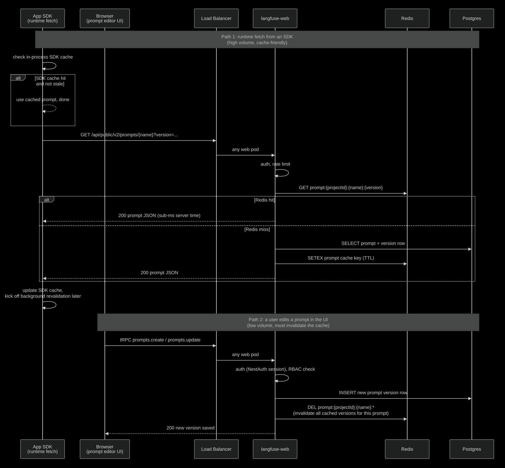

# poc : self-hosting langfuse
running langfuse on our own infra instead of paying for their cloud.


## why we want to self-host this

- data protection.
- cost.
- vendor independence - reducing dependency on langfuse.
- we get to put it behind our sso/auth-layer and our normal infra controls (vpc, audit logs, backups, etc).


## how langfuse is built

- there are 6 moving parts. 
- two of them are app code we run, four are data stores.

| component       | what is does                                                                          | stateful? |
| --------------- | ------------------------------------------------------------------------------------- | --------- |
| langfuse-web    | next.js app. serves the ui and the public api that sdk send traces to.                | no        |
| langfuse-worker | background processor. reads jobs from redis, writes processed traces to clickhouse.   | no        |
| postgres        | holds app config: users, projects, api keys, settings, evaluation configs.            | yes       |
| clickhouse      | holds the actual trace data. this is the big one (high-volume, time-series).          | yes       |
| redis           | job queue (bullmq) + cache + rate limit counters.                                     | yes       |
| s3              | blob store. raw trace events land here before workers read and process them.          | yes       |

- the web pod (langfuse-web) doesn't write directly to clickhouse during ingestion. 
- it writes the raw event to s3 + drops a job into redis. 
- the worker picks it up later and batches writes into clickhouse. 
- this buffering lets the system handle spikes without dropping data.

## deployment plan

> scale the app pods, share everything else.

### what we share

- one postgres cluster (managed, e.g. rds).
- one redis (managed, e.g. elasticache, with `maxmemory-policy=noeviction`).
- one clickhouse cluster (either clickhouse cloud, or self-run on a few ec2 nodes, or a kubernetes operator deployment).
- one s3 bucket (or two, if we want to split events and media).

### what we scale

- `langfuse-web` 
  - scale based on incoming HTTP traffic. 
  - sdk ingestion calls hit this. 
  - also serves the UI.

- `langfuse-worker` 
  - scale based on redis queue depth. 
  - if the queue grows, add more workers. 
  - they process trace events and write them to clickhouse.

- both scale independently. 
- a heavy ui day doesn't need more workers. 
- a heavy ingestion day doesn't need more web pods (well, a little, but mostly more workers).

### architecture



- solid lines are writes / queue ops. 
- dotted lines are reads the web pods do to serve the UI (e.g. when you open a trace).

### how one trace flows through



- the web pod's job stays **fast** because it never touches clickhouse on ingestion. 
- it just dumps the raw event to s3 and queues a job.
- that's why we can take ingestion spikes without falling over the queue.
- absorbs them, and the workers drain at whatever rate clickhouse can handle.

### how prompt management flows through

- prompt management is the other big public-api workload. 
- unlike trace ingestion, prompts live in **postgres** (not clickhouse)
- the read path is heavily cached in redis because production apps fetch the same prompt over and over again. 
- clickhouse and the worker are not involved at all here.
- production app might call `get_prompt(<prompt_label>)` thousands of times a minute. redis caching is what makes this cheap.
- SDKs also cache client side. 
- most server calls only happen on cold start or background refresh. so real traffic to the web pod is far lower.
- prompts are versioned. every edit creates a new row, old versions stay forever. 
- the `prompts` table grows slowly compared to clickhouse traces, so a small postgres is fine.
- when someone publishes a new version, the web pod deletes the cached entries so the next read picks up fresh data.



A few things to call out from this:


## what runs where

| component         | service we'd use                    |
| ----------------- | ----------------------------------- |
| `langfuse-web`    | ecs / eks / fargate                 |
| `langfuse-worker` | ecs / eks / fargate                 |
| postgres          | rds postgres 17                     |
| redis             | elasticache redis 7                 |
| clickhouse        | clickhouse cloud or self-run on EC2 |
| s3                | s3                                  |
| load balancer     | alb                                 |

## docker compose file
[docker-compose.prod.yml](./docker-compose.prod.yml)
```yaml
# only runs the web + worker.
# postgres, redis, clickHouse and s3 are expected to be running somewhere else
# copy .env.prod.example to .env.prod and fill in values 
# docker compose -f docker-compose.prod.yml --env-file .env.prod up -d
# docker compose -f docker-compose.prod.yml up -d --scale langfuse-web=3 --scale langfuse-worker=2

x-langfuse-env: &langfuse-env
  SALT: ${SALT}
  NEXTAUTH_URL: ${NEXTAUTH_URL}
  ENCRYPTION_KEY: ${ENCRYPTION_KEY}
  NEXTAUTH_SECRET: ${NEXTAUTH_SECRET}
  TELEMETRY_ENABLED: "false"

  REDIS_HOST: ${REDIS_HOST}
  REDIS_PORT: ${REDIS_PORT:-6379}
  REDIS_AUTH: ${REDIS_AUTH}
  REDIS_TLS_ENABLED: ${REDIS_TLS_ENABLED:-false}
  DATABASE_URL: ${DATABASE_URL}
  CLICKHOUSE_URL: ${CLICKHOUSE_URL}                      
  CLICKHOUSE_USER: ${CLICKHOUSE_USER}
  CLICKHOUSE_PASSWORD: ${CLICKHOUSE_PASSWORD}
  CLICKHOUSE_MIGRATION_URL: ${CLICKHOUSE_MIGRATION_URL}  
  CLICKHOUSE_CLUSTER_ENABLED: ${CLICKHOUSE_CLUSTER_ENABLED:-false}
  LANGFUSE_S3_EVENT_UPLOAD_BUCKET: ${S3_BUCKET}
  LANGFUSE_S3_EVENT_UPLOAD_REGION: ${S3_REGION}
  LANGFUSE_S3_EVENT_UPLOAD_ENDPOINT: ${S3_ENDPOINT} # leave empty for AWS S3
  LANGFUSE_S3_EVENT_UPLOAD_ACCESS_KEY_ID: ${S3_ACCESS_KEY_ID}
  LANGFUSE_S3_EVENT_UPLOAD_SECRET_ACCESS_KEY: ${S3_SECRET_ACCESS_KEY}
  LANGFUSE_S3_EVENT_UPLOAD_FORCE_PATH_STYLE: ${S3_FORCE_PATH_STYLE:-false}
  LANGFUSE_S3_EVENT_UPLOAD_PREFIX: "events/"
  LANGFUSE_S3_MEDIA_UPLOAD_BUCKET: ${S3_BUCKET}
  LANGFUSE_S3_MEDIA_UPLOAD_REGION: ${S3_REGION}
  LANGFUSE_S3_MEDIA_UPLOAD_ENDPOINT: ${S3_ENDPOINT}
  LANGFUSE_S3_MEDIA_UPLOAD_ACCESS_KEY_ID: ${S3_ACCESS_KEY_ID}
  LANGFUSE_S3_MEDIA_UPLOAD_SECRET_ACCESS_KEY: ${S3_SECRET_ACCESS_KEY}
  LANGFUSE_S3_MEDIA_UPLOAD_FORCE_PATH_STYLE: ${S3_FORCE_PATH_STYLE:-false}
  LANGFUSE_S3_MEDIA_UPLOAD_PREFIX: "media/"
  LANGFUSE_S3_BATCH_EXPORT_ENABLED: "false"
  EMAIL_FROM_ADDRESS: ${EMAIL_FROM_ADDRESS:-}
  SMTP_CONNECTION_URL: ${SMTP_CONNECTION_URL:-}

services:
  langfuse-web:
    image: langfuse/langfuse:3.130.0 # pin to a specific version, do not use :3 in prod
    restart: always
    environment:
      <<: *langfuse-env
    ports:
      - "3000:3000"
    healthcheck:
      test: ["CMD-SHELL", "wget -qO- http://localhost:3000/api/public/health || exit 1"]
      interval: 10s
      timeout: 5s
      retries: 5
      start_period: 30s
    deploy:
      resources:
        limits:
          cpus: "2"
          memory: "4G"
        reservations:
          cpus: "0.5"
          memory: "1G"

  langfuse-worker:
    image: langfuse/langfuse-worker:3.130.0
    restart: always
    environment:
      <<: *langfuse-env
    # No published port. 
    # worker only consumes from redis and writes to postgres / clickHouse / s3.
    # port:3030 inside the container is a private `/health` endpoint for liveness checks.
    healthcheck:
      test: ["CMD-SHELL", "wget -qO- http://localhost:3030/api/health || exit 1"]
      interval: 10s
      timeout: 5s
      retries: 5
      start_period: 30s
    deploy:
      resources:
        limits:
          cpus: "2"
          memory: "4G"
        reservations:
          cpus: "0.5"
          memory: "1G"

```

- no postgres, redis, clickhouse, or minio services. 
- just the two app services. everything else is external.
- both services share the same env block via a YAML anchor (`x-langfuse-env`). this guarantees the secrets are identical on web and worker.
- the worker has no published port. 
- it only takes work from redis. the `3030` port inside the container is just for the health check.
- scaling on one host can done with `--scale`, example :


   ```bash
   docker compose -f docker-compose.prod.yml up -d \
   --scale langfuse-web=3 \
   --scale langfuse-worker=2
   ```

### environment variables we need to set
[.env.prod.example](./.env.prod.example)
```bash
# secrets
SALT=
ENCRYPTION_KEY=
NEXTAUTH_SECRET=
NEXTAUTH_URL=https://langfuse.shl.com
# postgres
DATABASE_URL=
# clickhouse
CLICKHOUSE_URL=
CLICKHOUSE_USER=
CLICKHOUSE_PASSWORD=
CLICKHOUSE_MIGRATION_URL=
CLICKHOUSE_CLUSTER_ENABLED=
# redis
REDIS_HOST=
REDIS_PORT=
REDIS_AUTH=
REDIS_TLS_ENABLED=
# s3
S3_BUCKET=
S3_REGION=
S3_ENDPOINT=
S3_ACCESS_KEY_ID=
S3_FORCE_PATH_STYLE=
S3_SECRET_ACCESS_KEY=
```
